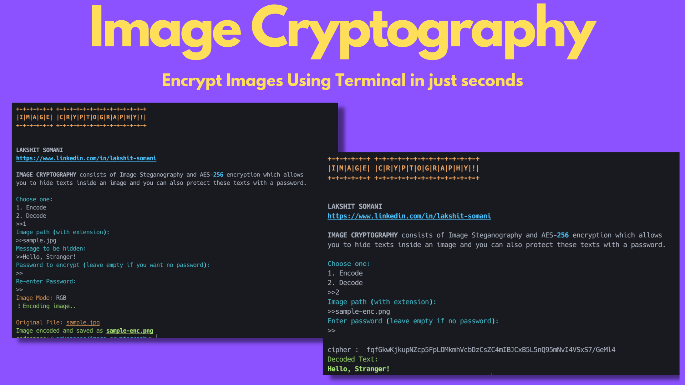
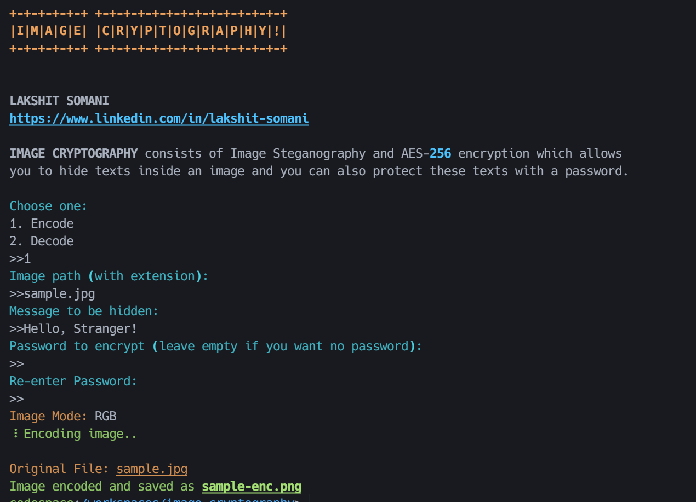
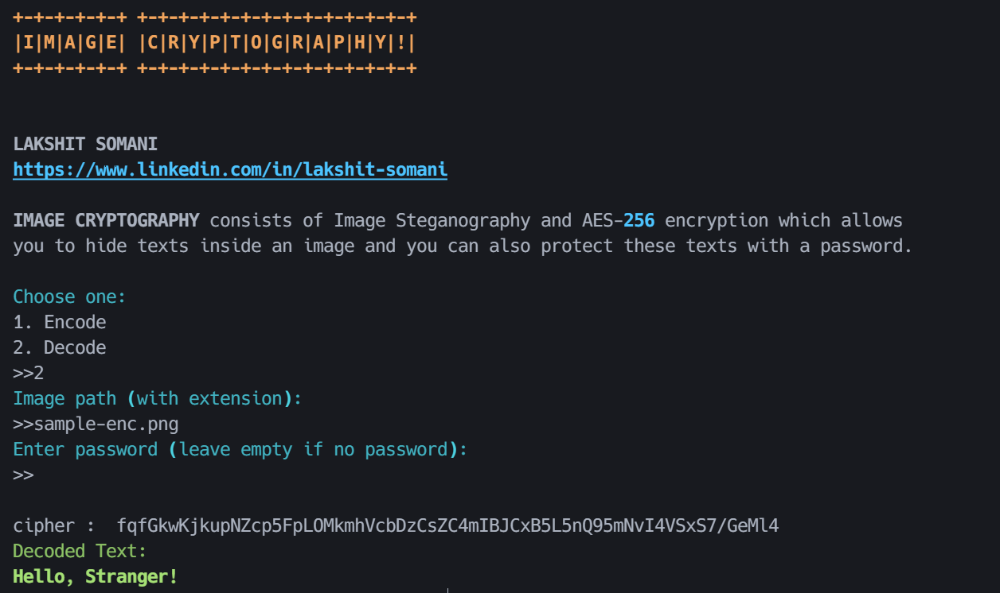

# IMAGE CRYPTOGRAPHY
  

<!--  -->

Hide secret texts/messages inside an image! And  you can also optionally encrypt your texts with a password using AES-256 encryption before encoding into the image.

Inspired from this [Medium post](https://medium.com/better-programming/image-steganography-using-python-2250896e48b9)

 

## Installation

You can install the all requirements from **requirements.txt** by using pip.

`pip install -r requirements.txt` 

## Usage

`python main.py`

**Encode**

- Choose *Encode* in the options menu

- Enter the image path (with extension)

- Enter the message to be hidden

- Choose a password to encrypt with AES-256 (optional)
  
<em>The image is encoded and saved as a ***PNG*** file.</em>

  Suppose the image to be encoded is this:

 

> Image Credits : [Kristopher Roller](https://unsplash.com/@krisroller)

 

After encoding, image looks like this:

***Visually, no change seen. The size change is just seen because I had to compress images to show in readme. Originally no change seen in images.***

**Decode**

- Choose *Decode* from the menu

- Enter the path of the encoded image (with extension) and type in the password to decrypt (leave empty if no password was used)
  

The decoded text will be displayed on the terminal.
